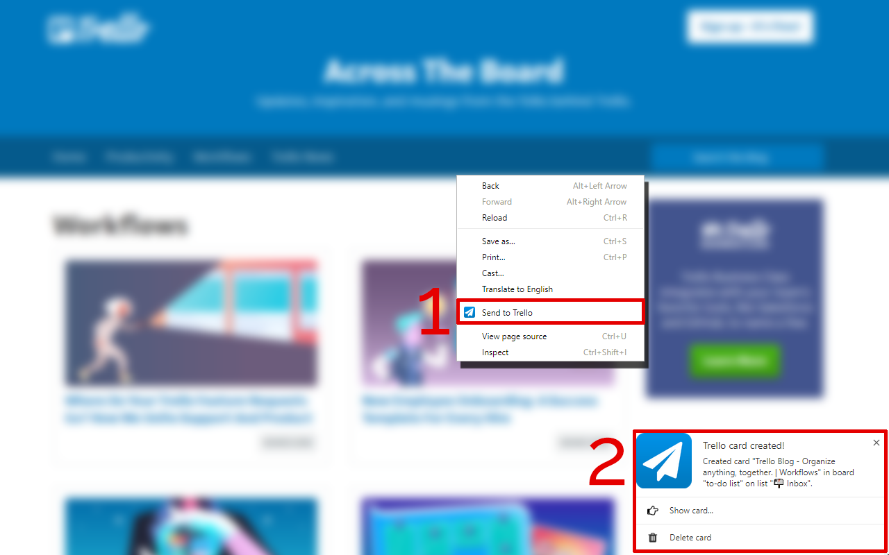
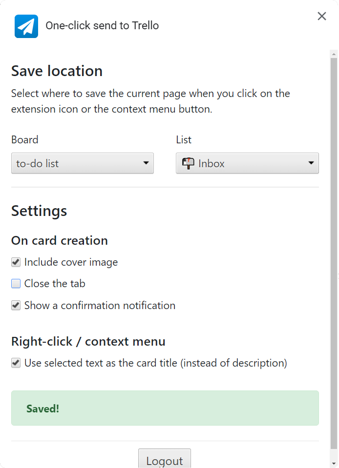

 

# One-click send to Trello

*One-click send to Trello* is an open source Chrome extension that simplifies creating a Trello card from a website. It's available on the [Chrome Web Store](https://chrome.google.com/webstore/detail/one-click-send-to-trello/khhjgfllkgcfhhgocmiaknngnjncdbjm). 

This extension simplifies using Trello by making certain actions just one click away. If you regularily save links or text from websites you visit to a Trello card on a specific board and list, then this extension does this for you in a single click!

## Installation

1. Go to the [Chrome Web Store Page](https://chrome.google.com/webstore/detail/one-click-send-to-trello/khhjgfllkgcfhhgocmiaknngnjncdbjm)
2. Install the extension
3. Click the extension button, which will take you to the Trello authentication page

## About

User feedback upon clicking the extension button is immediate, even though the actual Trello card creation can take a few seconds. Card creation is handled in the background and in the rare case of an error, the user is notified.

Several settings based on user feedback (see Chrome Store) and common use cases are available (see screenshots).

This extension is self-contained (i.e. includes all dependencies directly). It uses bootstrap and jQuery for the settings page, but is otherwise written in pure javascript using the Trello JS API provided by Trello.

### Screenshots

### Contributing

Contributions are welcome
